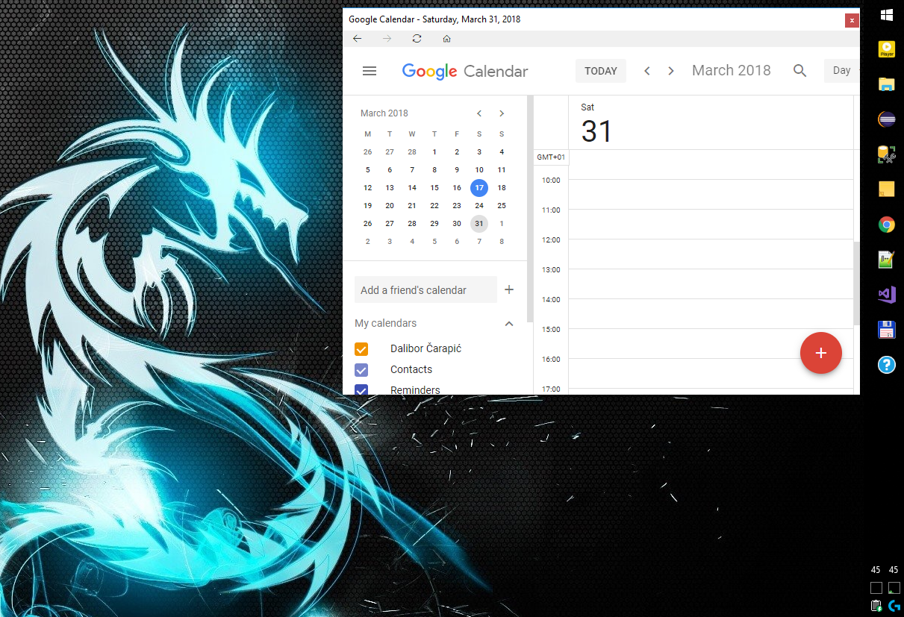

# OP.WebWidget

OP.WebWidget is a command line application which can be used to place a widget like windows on your desktop.
Each widget window uses a Chrome engine to display the configured page.

## Dependencies
The application depends on the following NuGet packages:
- CEF - the Chromium Embedded Framework
- CefSharp Chromium-based browser component (WinForms control)
- CommandLineParser (Note: Do not update to v2 as it has breaking changes!)

## Command line options
The application supports the following command line options:

    --url http://xxx.yyy.com

    The initial URL that will be loaded.

    --save-session=[true|false]

    If true then the browser session is stored and can be reused. If false then the browser is basically working in Anonymous mode. 
    Default value is false.

    --session-folder="..path.."

    The folder where the browser session information is stored if -s option is set. 
    Default value is %LOCALAPPDATA%\OP.WebWidged folder is used.

    --screen=[1|2...]

    Screen on which the window should appear. If not set then primary screen will be used.

    --position=0,0

    Initial position 'x,y' of the window. Negative values will offset the window from the right/bottom.

    --size=800,600

    Initial size 'width,height' of the window.

    --no-sendtoback

    The widget window is not automatically send to back and kept under other windows when not active.

    --border-style=[None|Fixed|Sizable]

    Window border style.
    Default is Fixed.

    --no-toolbar

    Hide browser toolbar (back, forward and home buttons).

    --no-toolbar-close

    Hide close window buttn.

    --no-toolbar-prev

    Hide browser back button.

    --no-toolbar-next

    Hide browser forward button.

    --no-toolbar-refresh

    Hide browser refresh button.

    --no-toolbar-home

    Hide browser home button. Home button navigates to initial URL.

    --config-file

    File containing configuration file. Each line in the file must hold the command line options and each line will open a new window. Any additional options (except --url will be forwarded to new windows).

# Examples

    --url="https://calendar.google.com/"
    Open Google calendar.

    --url="https://mail.google.com/" --save-session --position=-100;-30 --size=800;600 --border-style=Fixed
    Open Google mail. Save the session so that you will remain logged in.

